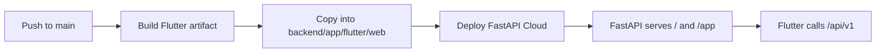

# SEO Python Hub
## Deployment Runbook

> **One origin. Two experiences.** FastAPI owns the public pages, API, and Flutter Web application.



## Production URLs

| Surface | URL |
| --- | --- |
| Backend home | https://seo-python-hub-437e0515.fastapicloud.dev/ |
| Flutter application | https://seo-python-hub-437e0515.fastapicloud.dev/app |
| Flutter deep link | https://seo-python-hub-437e0515.fastapicloud.dev/app/dashboard |
| API documentation | https://seo-python-hub-437e0515.fastapicloud.dev/docs |
| Health check | https://seo-python-hub-437e0515.fastapicloud.dev/health |

## Release

Run these commands from the repository root:

```bash
# Build Flutter with /app/ paths and copy it into the FastAPI package.
python scripts/build_flutter.py

# Run backend tests before deployment.
cd backend
uv run pytest

# Then push in Github.
```

The build helper automatically:

- runs `flutter pub get`;
- builds Flutter Web with `--base-href /app/`;
- embeds the FastAPI API URL through `API_BASE_URL`;
- verifies `build/web/index.html` exists;
- copies the artifact into `backend/app/flutter/web`.

## Git workflow

```bash
git status
git add .
git commit -m "Describe the change"
git pull --rebase origin main
git push origin main
```

GitHub Actions validates the Flutter build and backend tests. FastAPI Cloud must
be connected to this repository and configured to run the Flutter build helper
before deploying the `backend` directory.

## Local development

Start the backend:

```bash
cd backend
uv sync --dev
uv run uvicorn app.main:app --reload
```

In another terminal, run Flutter against the local backend:

```bash
cd frontend
flutter pub get
flutter run -d chrome --dart-define=API_BASE_URL=http://127.0.0.1:8000
```

Useful local endpoints:

```text
http://127.0.0.1:8000/
http://127.0.0.1:8000/app
http://127.0.0.1:8000/docs
http://127.0.0.1:8000/health
```

## Release checklist

- [ ] `python scripts/build_flutter.py` completes successfully.
- [ ] `uv run pytest` passes from `backend/`.
- [ ] `/health` returns `200`.
- [ ] `/app` loads the Flutter application.
- [ ] `/app/dashboard` loads after a direct browser refresh.
- [ ] `/docs` displays the current API contract.
- [ ] FastAPI Cloud deploys the same commit used to build Flutter.

